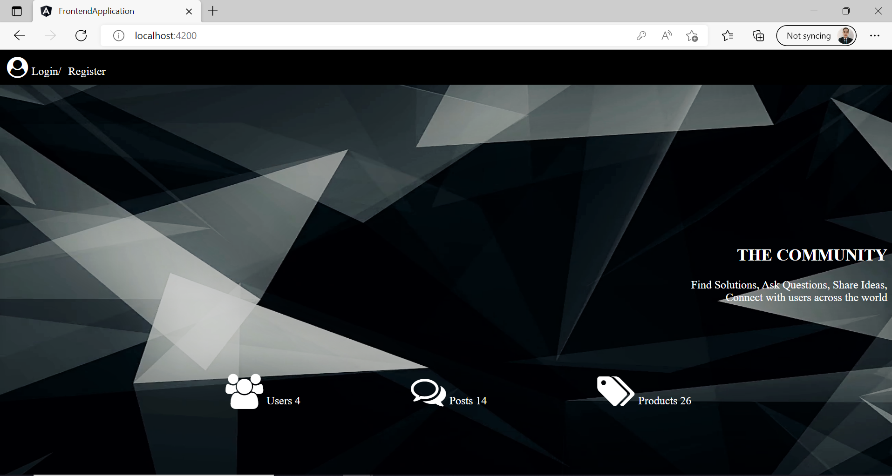
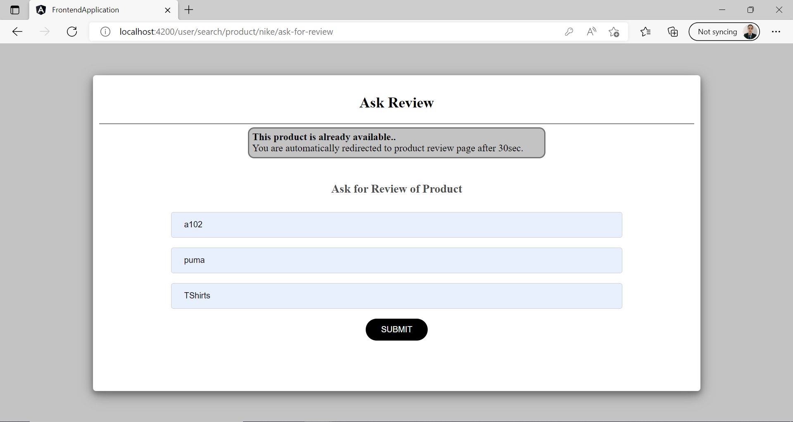
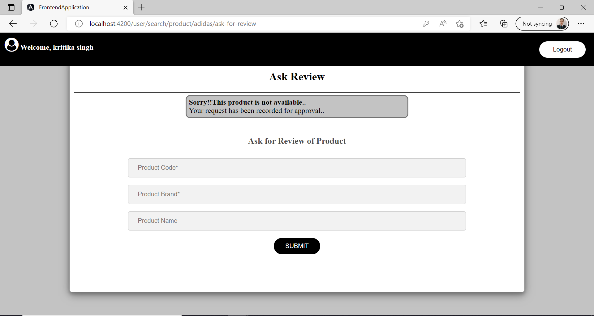

# PRODUCT COMMUNITY WEBSITE

## Description:

1. This is a product community website where a customer can visit, register themselves, 
   browse products, raise for review, post reviews.
2. There are two types of user of this application:
   1. Normal User
   2. Admin User
3. Normal user can browse product on bases of certain parameters, raise review request 
   and post reviews for product.
4. Admin user can see review on different product and he can approve and reject those review.
5. Frontend: 
   - This is develop on Angular version 13.3.6.
   - This webpage has two types of User:
     1. Normal User- This user does not has any special privilege.
     2. Admin User - This user has special privilege and special email id to login.
   - This application has main module 'App' and it has two sub-moudules:
     1. User Module 
     2. Admin Module
   - User can login / Register
   - Only logged in user can use further functionalities.
   - If user is Admin then:
     1. Admin can login with special credentials
     2. After successfully login he can see all new Reviews 
     3. Admin has a right to accept or reject all new reviews.
     4. Only approved reviews are visible to frontstore.
   - If user is not Admin then: 
     1. If user does not has account then he/she can register.
     2. If user alreay has account then he/she can login with their credentials
     3. After successfully login user can see search bar to search product by their name, brand and code. 
     4. For search, user can use one or more attribute as per their choice.
     5. User can filter the searched list according to brand and rating.
     6. User can post review on product and can also watch previous approved reviews.
     7. User can ask for review of product.
6. Backend:
   - Database: 
     1. Database use for this application is MySQL.
     2. Database Name- community
     3. There are three tables in Community Database-
        * Product(code(key), brand, name, avgReview, noOfRating, approve)
        * Review(reviewId(key), productCode,heading, review,rating,approve)
        * User(email(key), firstname, lastname, password) 
   - There are two types of controllers in this application:
     1. For Normal User API Application- 
         http://localhost:8082/api/v1/user/
     2. For Admin User API Application-
         http://localhost:8082/api/v1/admin/  

## Tech Stack

1. angular v13.3.6
2. node v14.16.0
3. java-11-openjdk-11.0.5-2
4. apache-maven-3.6.3

## Project Setup
Clone project- git clone https://github.com/kritika-singh-sengar/ecommerce-website.git
1. **_Backend Application_**
   * Install mysql and run the script inside init folder to mysql database.
   * Go to BackendApplication -> Backend then run : mvn clean install
   * This application is hosted on localhost at port number 8082.
2. **_Frontend Application_**
   * Go to folder FrontendApplication and run follwing commands: 
     - npm install
     - ng serve -o
   * This application is hosted on localhost at port number 4200.
    
## 1. For Normal User:

   ### _**Home Page:**_

   1. Home page has links for Registration and Login.
   2. It shows statistics such as number of registered users, number of
      products, number of reviews
      

   ### _**Login Page:**_

   1. There are two types of user of this application:
      - Admin User
      - Normal User
   2. Normal User Credential :
      - Username- kritikasingh@gmail.com
      - password- kritika123@
   3. In case of invalid authentication error message will display.
      

   4. Routes are guarded, If without login user try to use this application, then after alert message user will automatically redirect to login page.
      

   ### _**Registration Page:**_

   1. The application has a registration page.
   2. User should be able to register.
   3. Validation for email address, password policy (min length 8),
      mandatory fields such as name is performed.
      

   ### _**Product Search Page:**_

   Search screen should search the input text against all input parameters specified such as (name, code, brand).
   1. Search by Brand:
      > 
   2. Search by Name:
      > 
   3. Search By Code:
      > 
   4. Search By all Parameters:
      > 

   ### _**Results Page:**_

   1.  Once Search is triggered after specifying the search parameters, It will
      display the search results using the API from Backend Application.
      
      1. Search Result by Brand:
        > 
      2. Search Result By Name:
        > 
      3. Search Result by Code:
        > 
      4. Search Result By all Parameters:
        > 
   2. The user should be able to see the products and filter them further
      by code and rating. User should be able to see all products with average ratings, number of reviews etc.
      
   3. If no results are found, then error message displayed on screen.
      

   ### _**Product Details:**_

   User can select a product and view all reviews provided for that product.
   

   ### _**Post a review:**_

   User can post a review to a product by submitting a simple form with
   fields such as:
      1. Ratings (1-5),
      2. Heading
      3. Review (min. 20 characters and max 400 characters)
         

   ### _**Ask For Reviews:**_

   1. User can raise for reviews on a product by submitting a simple form with
      fields such as:
      - Product name
      - code
      - brand.
      

   2. If a product code already exists in a system, it will provide an error message that the product already exists and will redirect to the product review page after 30 seconds.
   - When product is already available:
      
      

   - When Product not available:
      
      
      
   - When Product is available but not approved
      

## Admin Portal:

   1. Admin can login with special email id- admin@gmail.com (assumption)
   2. Only admin@gmail.com has admin right. No other user can use admin
      functionalities.
      
   3. Logged in administrator can view all the new reviews and either approve
      or reject them.
   4. Only approved reviews are then visible on storefront and average ratings
      are calculated from approved reviews only.

   ## **Login Screen:**

   

   ## Admin home screen:

   
